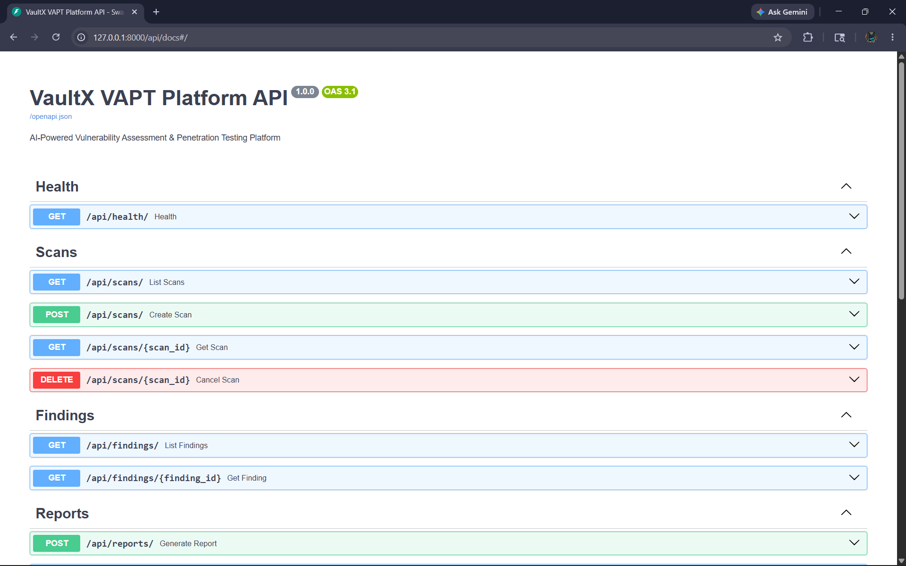

# vaultX

vaultX is an AI-powered VAPT automation demo built to simplify reconnaissance, scanning, vulnerability analysis, and report generation.

## Project Status

This is the demo version of vaultX.

The current version focuses on backend workflow, target handling, scanning modules, vulnerability analysis structure, and report generation. The frontend and full production deployment are planned for future versions.

## Problem Statement

Security testing often requires multiple tools, manual recon, repeated scanning steps, noisy outputs, and time-consuming report writing. vaultX is designed to bring these steps into one structured workflow so testers can move faster and review results more clearly.

## Current Demo Features

- Target input handling
- Recon workflow structure
- Network scanning support
- Web/API scanning workflow
- Basic vulnerability analysis
- Report generation structure
- Sample report output
- False-positive reduction focus

## Tech Stack

- Python
- FastAPI
- Nmap
- Feroxbuster
- Kali Linux tools
- Custom scanning modules

## Folder Structure

```txt
vaultX/
├── backend/
├── agents/
├── tools/
├── reports/
├── docs/
├── tests/
├── requirements.txt
└── README.md
```

## Installation

```bash
git clone https://github.com/Kxthetix/vaultX.git
cd vaultX
python -m venv venv
```

Windows:

```bash
venv\Scripts\activate
```

Linux/macOS:

```bash
source venv/bin/activate
```

Install dependencies:

```bash
pip install -r requirements.txt
```

## Run the Demo

```bash
uvicorn backend.main:app --reload
```

Open the API documentation:

```txt
http://127.0.0.1:8000/docs
```

## Example Workflow

```txt
Target Input
     ↓
Recon Engine
     ↓
Network Enumeration
     ↓
Web/API Scanning
     ↓
Vulnerability Analysis
     ↓
Report Generation
```

## Sample Use Cases

- Learning VAPT workflow automation
- Practicing recon and scanning workflows
- Understanding backend structure for cybersecurity tools
- Building a base for AI-assisted vulnerability analysis

## Demo Status

The current demo backend is working locally with FastAPI and Swagger API documentation.



## Roadmap

- Add complete frontend dashboard
- Improve AI-based vulnerability analysis
- Add authentication
- Add scan history
- Add PDF report generation
- Add Docker production setup
- Add more security tool integrations
- Improve false-positive validation

## Disclaimer

vaultX is built only for educational and authorized security testing purposes.

Do not use this tool on systems you do not own or do not have permission to test. The developer is not responsible for misuse or illegal activity.

## Author

Kishore Kumar P R

GitHub: https://github.com/Kxthetix
